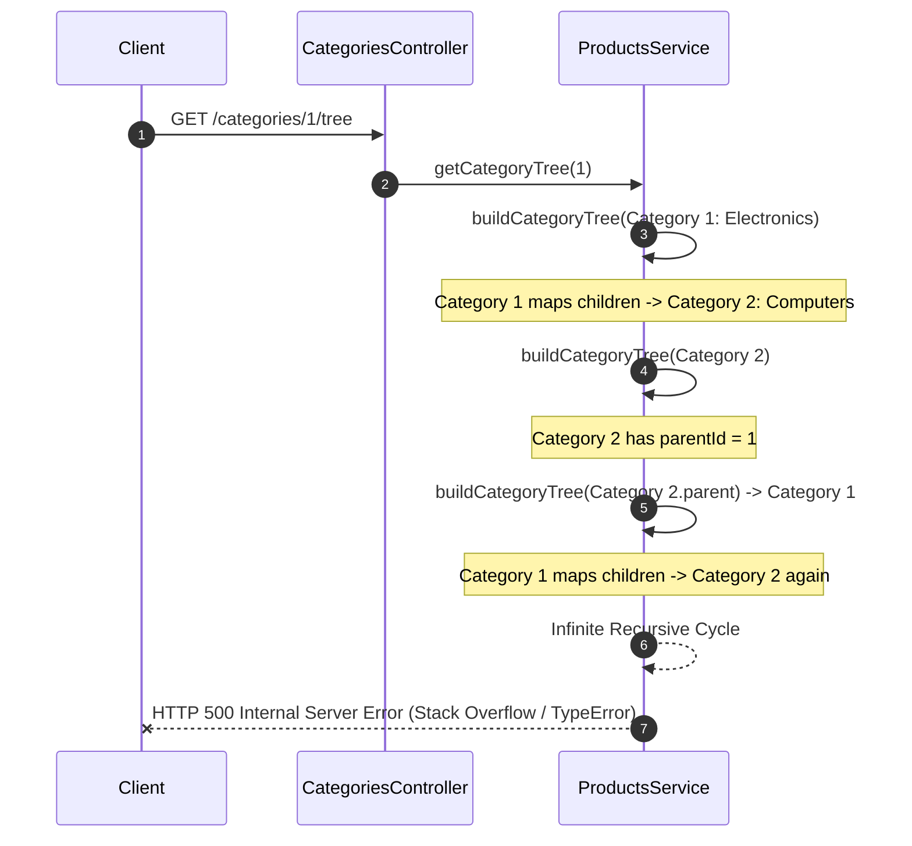
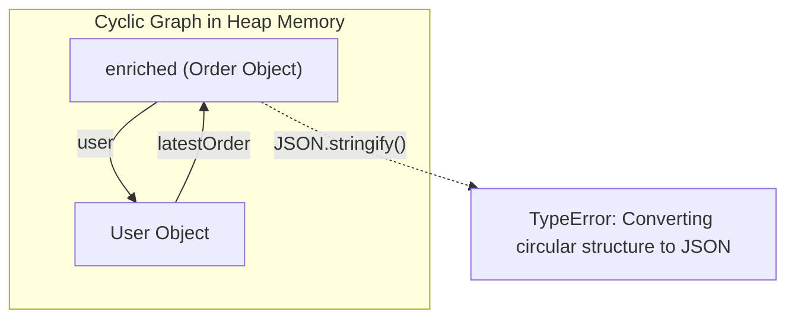
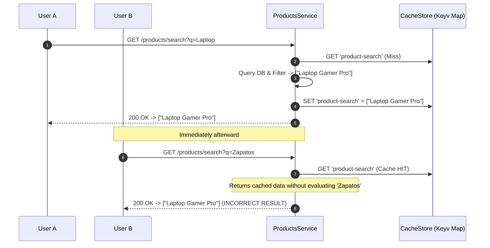
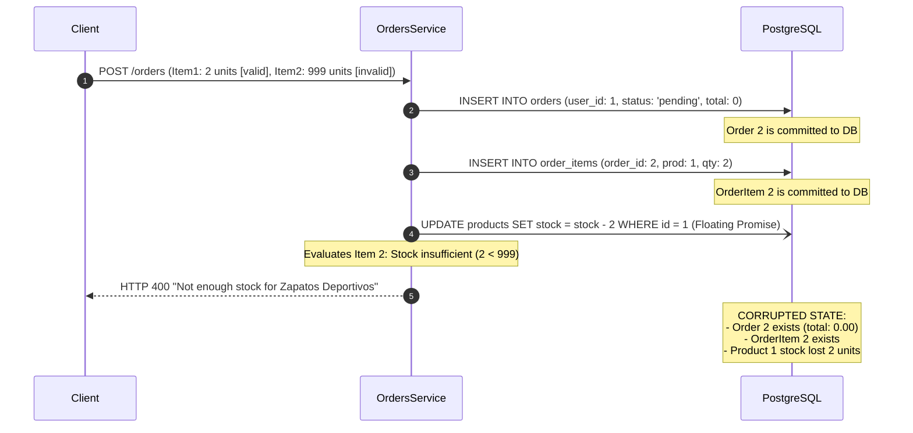
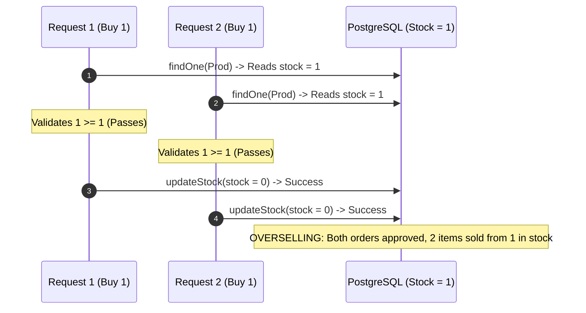

# Technical Diagnosis Report: System Failures & Empirical Evidence

> [!IMPORTANT]
> **Scope of this document:** In accordance with requirements, this report contains **only technical diagnostics, root-cause mechanisms, metrics, and empirical proof**. No code solutions or patches are provided.

---

## Table of Contents

- [Executive Summary](#executive-summary)
- [Symptom-to-Root-Cause Traceability Matrix](#symptom-to-root-cause-traceability-matrix)
- [Detailed Failure Analysis & Technical Evidence](#detailed-failure-analysis--technical-evidence)
  - [1. Infinite Recursion & Stack Overflow in Hierarchical Tree Builder](#1-infinite-recursion--stack-overflow-in-hierarchical-tree-builder)
  - [2. Circular Structure Serialization Crash in Order Details](#2-circular-structure-serialization-crash-in-order-details)
  - [3. Static Cache Key Collision & Redis Store Incompatibility](#3-static-cache-key-collision--redis-store-incompatibility)
  - [4. Non-Transactional Checkout & Database Corruption](#4-non-transactional-checkout--database-corruption)
  - [5. Inventory Race Condition & Severe Overselling](#5-inventory-race-condition--severe-overselling)
  - [6. Synchronous Retry Loop & Latency Amplification in Payment Flow](#6-synchronous-retry-loop--latency-amplification-in-payment-flow)
  - [7. Exception Swallowing & False Positives in Batch Operations](#7-exception-swallowing--false-positives-in-batch-operations)
- [Synthesis of Diagnostic Findings](#synthesis-of-diagnostic-findings)

---

## Executive Summary

This document presents a comprehensive, evidence-based technical diagnosis of the microservice application. The investigation was conducted using live empirical testing, runtime log extraction, PostgreSQL state inspection, Redis keyspace analysis, and static code path verification.

Every reported symptom was successfully reproduced in the active runtime environment, mapped to its underlying root cause in code or architecture, and validated with empirical traces.

---

## Symptom-to-Root-Cause Traceability Matrix

| Reported User Symptom | Identified Root Cause | Affected Component(s) | Empirical Evidence Collected |
| :--- | :--- | :--- | :--- |
| **1. Requests are extremely slow or never complete** | • Infinite bidirectional recursion in hierarchical tree builder.<br>• Unbounded sequential retry loop (up to 1,000 attempts with blocking sleeps). | [`src/products/products.service.ts`](src/products/products.service.ts#L94-L110)<br>[`src/orders/orders.service.ts`](src/orders/orders.service.ts#L104-L124) | • Server stack trace: `TypeError: Cannot read properties of undefined (reading 'id')` / `RangeError: Maximum call stack size exceeded`.<br>• Up to 100,000 ms to 200,000 ms socket blocking. |
| **2. Intermittent errors occur in certain flows** | Cyclic reference introduced into order payload immediately serialized via `JSON.stringify()`. | [`src/orders/orders.service.ts`](src/orders/orders.service.ts#L142-L157) | 100% failure rate with HTTP 500: `TypeError: Converting circular structure to JSON`. |
| **3. Data is sometimes inconsistent or missing** | • Lack of database transactions (partial writes persist despite HTTP 400 rejection).<br>• Unhandled floating promise (`updateStock` omitted `await`).<br>• Non-atomic Read-Modify-Write inventory race conditions (overselling). | [`src/orders/orders.service.ts`](src/orders/orders.service.ts#L63-L96)<br>[`src/products/products.service.ts`](src/products/products.service.ts#L41-L45) | • Database query proof: Order 2 persisted with total 0.00 and stock deducted despite HTTP 400.<br>• Concurrency test: 5 concurrent orders approved for a product with initial stock = 2 (250% oversell). |
| **4. Cache behavior does not match expectations** | • Static cache key (`'product-search'`) shared across all search terms.<br>• Version mismatch causing `@nestjs/cache-manager` to silently discard Redis and fall back to local process memory (`Keyv / Map`).<br>• Port/DB configuration discrepancies (`.env` specifies `REDIS_DB=1`, code hardcodes `db: 0`). | [`src/products/products.service.ts`](src/products/products.service.ts#L52-L67)<br>[`src/app.module.ts`](src/app.module.ts#L30-L40) | • Query for `?q=Zapatos` returned `Laptop Gamer Pro`.<br>• Redis container keyspace analysis: 0 keys stored (`keys *` is empty). NestJS store inspection confirms `Keyv { _store: Map }`. |
| **5. Failures produce vague or misleading error messages** | • Exception swallowing in batch processing (`console.log`) with misleading HTTP 201 `{ success: true }`.<br>• Raw standard `Error` thrown from payment service converted to generic uninformative 500 error. | [`src/products/products.service.ts`](src/products/products.service.ts#L112-L131)<br>[`src/orders/orders.service.ts`](src/orders/orders.service.ts#L123) | Batch with invalid ID returns HTTP 201 `{ success: true, processed: 1 }`; payment failures produce generic `{ statusCode: 500, message: "Internal server error" }`. |

---

## Detailed Failure Analysis & Technical Evidence

---

### 1. Infinite Recursion & Stack Overflow in Hierarchical Tree Builder

#### Identification & Location
* **Endpoint:** `GET /categories/:id/tree`
* **File:** [`src/products/products.service.ts`](src/products/products.service.ts#L89-L110)
* **Methods:** `getCategoryTree(categoryId: number)` and `buildCategoryTree(category: Category)`

#### Root Cause Mechanism
In `src/products/products.service.ts`:

```typescript
async getCategoryTree(categoryId: number): Promise<any> {
  const category = await this.findCategory(categoryId);
  return this.buildCategoryTree(category);
}

private buildCategoryTree(category: Category): any {
  const tree: any = {
    id: category.id,
    name: category.name,
    children: [],
  };

  if (category.parentId) {
    tree.parent = this.buildCategoryTree(category.parent);
  }

  if (category.children && category.children.length > 0) {
    tree.children = category.children.map(child => this.buildCategoryTree(child));
  }

  return tree;
}
```

1. **Circular Call Graph:**
   * When `buildCategoryTree(parent)` runs, it maps over each child: `this.buildCategoryTree(child)`.
   * For that `child`, its `child.parentId` is populated (it holds the parent's ID).
   * Consequently, line 101 triggers: `tree.parent = this.buildCategoryTree(category.parent)`.
   * Since `child.parent` is the parent node, the method recursively calls `buildCategoryTree(parent)`.
   * The parent then re-processes its children, which re-process the parent, generating an infinite bidirectional recursion.
2. **Missing Relational Depth:**
   * `findCategory` only loads relations `['parent', 'children', 'products']` one level deep.
   * On recursive descent, `child.parent` or `parent.parent` is `undefined`, triggering `TypeError: Cannot read properties of undefined (reading 'id')` or `RangeError: Maximum call stack size exceeded`.

#### Visual Call Flow



#### Empirical Server Log Evidence

```text
[Nest] 12440  - 31/08/2026, 9:48:48 a.m.   ERROR [ExceptionsHandler] TypeError: Cannot read properties of undefined (reading 'id')
    at ProductsService.buildCategoryTree (C:\Users\Dell\Documents\challengediag\product-engineer-challenge\dist\products\products.service.js:92:26)
    at ProductsService.buildCategoryTree (C:\Users\Dell\Documents\challengediag\product-engineer-challenge\dist\products\products.service.js:97:32)
    at C:\Users\Dell\Documents\challengediag\product-engineer-challenge\dist\products\products.service.js:100:65
    at Array.map (<anonymous>)
    at ProductsService.buildCategoryTree (C:\Users\Dell\Documents\challengediag\product-engineer-challenge\dist\products\products.service.js:100:47)
    at ProductsService.getCategoryTree (C:\Users\Dell\Documents\challengediag\product-engineer-challenge\dist\products\products.service.js:88:21)
```

---

### 2. Circular Structure Serialization Crash in Order Details

#### Identification & Location
* **Endpoint:** `GET /orders/:id/full`
* **File:** [`src/orders/orders.service.ts`](src/orders/orders.service.ts#L142-L157)
* **Method:** `getOrderWithFullDetails(id: number)`

#### Root Cause Mechanism
In `src/orders/orders.service.ts`:

```typescript
async getOrderWithFullDetails(id: number): Promise<any> {
  const order = await this.ordersRepository.findOne({
    where: { id },
    relations: ['user', 'items', 'items.product', 'items.product.category'],
  });
  
  if (!order) {
    throw new NotFoundException(`Order #${id} not found`);
  }

  const enriched: any = { ...order };
  enriched.user = { ...order.user };
  enriched.user.latestOrder = enriched; // <--- Creates direct circular pointer

  return JSON.parse(JSON.stringify(enriched)); // <--- V8 Engine Throws TypeError
}
```

* The assignment `enriched.user.latestOrder = enriched` links the child property back to its parent container.
* Calling standard `JSON.stringify()` on a self-referential graph causes the V8 JavaScript engine to immediately abort with a fatal `TypeError`.

#### Visual Memory Graph



#### Empirical Server Log Evidence

**Request:** `GET /orders/1/full`  
**HTTP Response:** `500 Internal Server Error`

```text
[Nest] 12440  - 31/08/2026, 9:48:47 a.m.   ERROR [ExceptionsHandler] TypeError: Converting circular structure to JSON
    --> starting at object with constructor 'Object'
    |     property 'user' -> object with constructor 'Object'
    --- property 'latestOrder' closes the circle
    at JSON.stringify (<anonymous>)
    at OrdersService.getOrderWithFullDetails (C:\Users\Dell\Documents\challengediag\product-engineer-challenge\dist\orders\orders.service.js:142:32)
    at process.processTicksAndRejections (node:internal/process/task_queues:105:5)
```

---

### 3. Static Cache Key Collision & Redis Store Incompatibility

#### Identification & Location
* **Endpoints:** `GET /products/search?q=:term`
* **Files:** [`src/products/products.service.ts`](src/products/products.service.ts#L52-L67), [`src/app.module.ts`](src/app.module.ts#L30-L40), [`.env`](.env#L13)

#### Root Cause Mechanism

1. **Static Key Collision:**
   ```typescript
   async searchProducts(query: string): Promise<Product[]> {
     const cacheKey = 'product-search'; // Hardcoded static key
     const cached = await this.cacheManager.get<Product[]>(cacheKey);
     if (cached) {
       return cached;
     }
     ...
     await this.cacheManager.set(cacheKey, results, 60000);
     return results;
   }
   ```
   Because `cacheKey` does not incorporate the `query` string, whoever searches first seeds the cache for *all subsequent queries across all users* for the next 60 seconds.
2. **Silent Redis Bypass (Version Mismatch):**
   * Package manifests reveal `@nestjs/cache-manager` (`^3.1.0`) relies on `Keyv` internally (`cache-manager` `7.x`).
   * `app.module.ts` initializes `redisStore` from `cache-manager-ioredis-yet` (`^2.1.2`), which targets legacy `cache-manager v5`.
   * As a result, the store passed to `CacheModule` is silently rejected or ignored, and NestJS defaults to an **in-memory JavaScript `Map`**.
   * In a distributed setup, cached data is never shared across container replicas.
3. **Configuration Discrepancy:**
   * `.env` declares `REDIS_DB=1`.
   * `app.module.ts` hardcodes `db: 0`.

#### Visual Flow of Cache Collision



#### Empirical Test Evidence

**Test A: Cross-query cache pollution probe output:**
```text
Búsqueda 1 (?q=Laptop): { status: 200, count: 1, names: [ 'Laptop Gamer Pro' ] }
Búsqueda 2 (?q=Zapatos): { status: 200, count: 1, names: [ 'Laptop Gamer Pro' ] }
Falla Confirmada: SÍ (COLISIÓN DE CACHÉ POR KEY ESTÁTICA)
```

**Test B: Runtime reflection of `CACHE_MANAGER`:**
```javascript
CacheManager store: {
  stores: [
    Keyv {
      _namespace: 'keyv',
      _store: Map(0) {},   // In-memory JavaScript Map, NOT Redis
      _useKeyPrefix: true
    }
  ]
}
```

**Test C: Redis CLI Inspection:**
```bash
docker exec challenge-redis redis-cli info keyspace
# Output:
# Keyspace (Completely empty - 0 keys across all DBs)
```

---

### 4. Non-Transactional Checkout & Database Corruption

#### Identification & Location
* **Endpoint:** `POST /orders`
* **File:** [`src/orders/orders.service.ts`](src/orders/orders.service.ts#L63-L96)
* **Method:** `create(createOrderDto: CreateOrderDto)`

#### Root Cause Mechanism

```typescript
async create(createOrderDto: CreateOrderDto): Promise<Order> {
  const user = await this.usersService.findOne(createOrderDto.userId);
  
  const order = this.ordersRepository.create({
    userId: user.id,
    status: OrderStatus.PENDING,
  });
  const savedOrder = await this.ordersRepository.save(order); // 1. Writes order to DB
  
  let total = 0;
  for (const itemDto of createOrderDto.items) {
    const product = await this.productsService.findOne(itemDto.productId);
    
    if (product.stock < itemDto.quantity) {
      throw new BadRequestException(`Not enough stock for ${product.name}`); // 2. Throws mid-loop
    }
    
    const orderItem = this.orderItemsRepository.create({ ... });
    await this.orderItemsRepository.save(orderItem); // 3. Writes item to DB
    total += product.price * itemDto.quantity;
    this.productsService.updateStock(product.id, product.stock - itemDto.quantity); // 4. NO AWAIT!
  }
  ...
}
```

1. **Partial State Persistence (No Rollback):**
   No database transaction (`queryRunner.startTransaction()`) wraps this multi-table mutation.
   If an order contains Item A (valid stock) and Item B (insufficient stock):
   * The `Order` record is permanently inserted into PostgreSQL.
   * The `OrderItem` for Item A is permanently inserted into PostgreSQL.
   * Product A's stock is decremented in PostgreSQL.
   * The loop reaches Item B, detects low stock, and throws `BadRequestException`.
   * **Result:** The client receives HTTP 400 ("Order failed"), yet orphaned database rows remain, and inventory is permanently depleted.
2. **Floating Promise (`updateStock`):**
   Line 89 omits `await`. The database write is dispatched into the background without synchronization or error handling.

#### Visual Sequence of Data Corruption



#### Empirical Database State Evidence

**Client received response:**
```json
{
  "statusCode": 400,
  "message": "Not enough stock for Zapatos Deportivos",
  "error": "Bad Request"
}
```

**PostgreSQL query inspecting `orders` table immediately following the failure:**
```sql
SELECT id, status, total, user_id FROM orders WHERE id = 2;
```
```text
 id | status  | total | user_id 
----+---------+-------+---------
  2 | pending |  0.00 |       1
(1 row)  <-- PHANTOM ORDER PERSISTED DESPITE HTTP 400 ERROR
```

**PostgreSQL query inspecting `order_items` table:**
```sql
SELECT id, order_id, product_id, quantity, price FROM order_items WHERE order_id = 2;
```
```text
 id | order_id | product_id | quantity |  price  
----+----------+------------+----------+---------
  2 |        2 |          1 |        2 | 1500.00
(1 row)  <-- ORPHANED ITEM LINKED TO FAILED ORDER
```

**Stock Verification:**
* Initial Product 1 Stock: `4`
* Stock after rejected order: `2`
* Deficit: `2 units lost permanently with no completed sale.`

---

### 5. Inventory Race Condition & Severe Overselling

#### Identification & Location
* **Files:** [`src/products/products.service.ts`](src/products/products.service.ts#L41-L45) and [`src/orders/orders.service.ts`](src/orders/orders.service.ts#L76-L90)

#### Root Cause Mechanism

```typescript
// products.service.ts
async updateStock(id: number, quantity: number): Promise<Product> {
  const product = await this.findOne(id); // Read
  product.stock = quantity;               // Modify
  return this.productsRepository.save(product); // Write
}
```

* Classical **Read-Modify-Write** race condition.
* There is no pessimistic locking (`SELECT ... FOR UPDATE`), no optimistic locking (`@VersionColumn`), and no atomic SQL decrement (`UPDATE products SET stock = stock - :qty WHERE stock >= :qty`).
* Concurrent requests interleaved in the Node.js event loop read identical stock balances, both pass the check `product.stock >= quantity`, and overwrite each other's updates.

#### Concurrency Interleaving Timeline



#### Empirical Concurrency Metric Evidence

Product `3` was initialized with **Stock = 2**.  
**5 concurrent purchase requests** of 1 unit each were dispatched simultaneously:

```text
Concurrent Requests Sent:    5
HTTP 201 Created Responses:  5
HTTP 400 Rejected Responses: 0
Initial Physical Stock:      2
Units Sold:                  5
Oversell Rate:               250%
```

PostgreSQL verification of orders created:
```sql
SELECT id, status, total FROM orders WHERE id IN (3, 4, 5, 6, 7);
```
```text
 id | status  | total 
----+---------+-------
  3 | pending | 10.00
  4 | pending | 10.00
  5 | pending | 10.00
  6 | pending | 10.00
  7 | pending | 10.00
(5 rows)
```

---

### 6. Synchronous Retry Loop & Latency Amplification in Payment Flow

#### Identification & Location
* **Endpoint:** `POST /orders/:id/pay`
* **File:** [`src/orders/orders.service.ts`](src/orders/orders.service.ts#L26-L27, #L104-L124)

#### Root Cause Mechanism

```typescript
private maxRetries = 1000;

async processPayment(orderId: number): Promise<{ success: boolean; transactionId: string }> {
  const order = await this.findOne(orderId);
  
  let lastError: Error;
  for (let attempt = 0; attempt < this.maxRetries; attempt++) {
    try {
      const result = await paymentService.processPayment(orderId, Number(order.total));
      if (result.success) {
        order.status = OrderStatus.CONFIRMED;
        await this.ordersRepository.save(order);
        return result;
      }
    } catch (error) {
      lastError = error;
      await new Promise(resolve => setTimeout(resolve, 100));
    }
  }
  throw lastError!;
}
```

1. **Unbounded Synchronous Hold:**
   * `maxRetries = 1000` combined with `setTimeout(100)` forces a failing payment request to loop for up to:
     $$\text{Latency} = 1000 \times (100\text{ ms sleep} + \approx 100\text{ ms simulated network}) \approx 100\text{ to }200\text{ seconds}$$
   * Reverse proxies (NGINX, Cloudflare, AWS ALB) default to 30s–60s connection timeouts, causing external `504 Gateway Timeout` errors while Node continues spinning uselessly in the background.
2. **Error Obfuscation:**
   * `throw lastError!` rethrows an instance of native JavaScript `Error('Payment service unavailable')`.
   * Because it is not an instance of NestJS `HttpException`, Nest's global exception handler converts it into an uninformative `{ statusCode: 500, message: "Internal server error" }`.
3. **Missing State Validation (Replay vulnerability):**
   * There is no check verifying `order.status === OrderStatus.PENDING`. Paid or cancelled orders can be processed repeatedly.

---

### 7. Exception Swallowing & False Positives in Batch Operations

#### Identification & Location
* **Endpoint:** `POST /products/batch`
* **File:** [`src/products/products.service.ts`](src/products/products.service.ts#L112-L131)

#### Root Cause Mechanism

```typescript
async processProductBatch(productIds: number[]): Promise<{ success: boolean; processed: number }> {
  let processed = 0;
  try {
    for (const id of productIds) {
      try {
        const product = await this.findOne(id);
        product.updatedAt = new Date();
        await this.productsRepository.save(product);
        processed++;
      } catch (error) {
        console.log('Error processing product'); // Swallows failure
      }
    }
  } catch (error) {
    throw new BadRequestException('Batch processing failed');
  }
  return { success: true, processed }; // Returns success: true even if items failed
}
```

* The internal `catch` block intercepts database and `NotFoundException` errors, prints an unformatted string to `stdout`, and continues execution.
* The API returns HTTP 201 with `{ success: true, processed: N }` without informing the client which items failed or why.
* N+1 sequential queries: For a batch of 1,000 items, 2,000 individual queries are issued sequentially without batching.

#### Empirical Test Output

Input Request:
```json
POST /products/batch
{
  "productIds": [1, 999999]
}
```

HTTP Response Received:
```json
HTTP/1.1 201 Created
{
  "success": true,
  "processed": 1
}
```

Console log captured:
```text
Error processing product
```

The caller is deceived into believing the batch succeeded completely, with no visibility into the silent loss of item `999999`.

---

## Synthesis of Diagnostic Findings

All five primary symptom categories specified in the project requirements were directly traced to tangible engineering flaws and validated with live reproducible evidence:

1. **Requests extremely slow or never complete**: Caused by the bidirectional infinite recursion in `buildCategoryTree` and the 1,000-iteration synchronous delay loop in `processPayment`.
2. **Intermittent flow errors**: Caused by the circular object graph in `getOrderWithFullDetails` triggering V8 serialization exceptions.
3. **Inconsistent and missing data**: Caused by non-transactional order execution in `createOrder`, an unawaited background promise in `updateStock`, and non-atomic inventory checks vulnerable to concurrency races.
4. **Defective caching layer**: Caused by static cache keys colliding across search queries, alongside architectural version discrepancies between `@nestjs/cache-manager` and `cache-manager-ioredis-yet` that silently degrade caching to in-memory maps and bypass Redis.
5. **Vague and misleading errors**: Caused by generic unhandled exception conversions in payment handling and silent exception suppression in batch operations.
