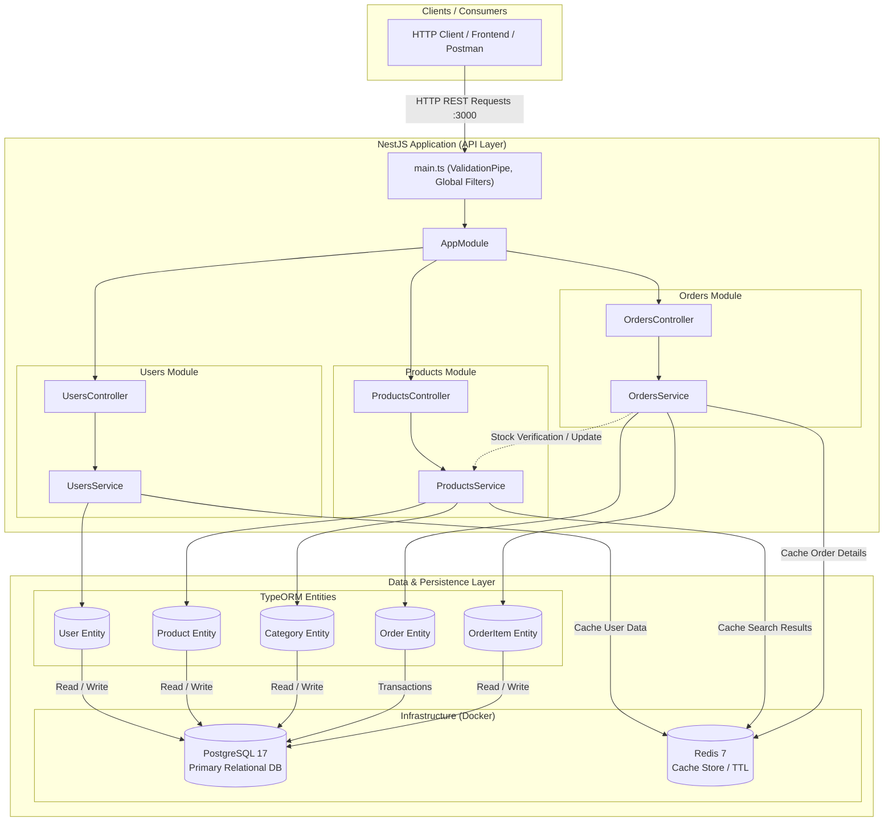

# Product Engineer Challenge

A multi-service e-commerce API built with NestJS, PostgreSQL, and Redis.

> 🎥 **[Ver video explicativo del reto (Google Drive)](https://drive.google.com/file/d/1I4oqpIVPAVf_y0itOI3VJeA90XCuDWwK/view?usp=sharing)**

## Architecture

This application uses:
- **NestJS** - Backend framework
- **PostgreSQL** - Primary database
- **Redis** - Caching layer
- **TypeORM** - Database ORM

### System Architecture Diagram



## Diagnosis
> 📋 **[View Diagnosis Report](./DIAGNOSIS.md)**

## Bugs
> 📋 **[View Bug Report](./BUGS.md)** — 25 identified bugs organized by priority

## Setup

### Prerequisites

- Node.js 20+
- pnpm
- Docker and Docker Compose

### Installation

```bash
pnpm install
```

### Create environment file

```bash
cp .env.sample .env
```

### Start services

```bash
docker-compose up -d
```

### Run the application

```bash
pnpm run start:dev
```

The API will be available at `http://localhost:3000`

## API Endpoints

### Users

| Method | Endpoint | Description |
|--------|----------|-------------|
| GET | /users | Get all users |
| GET | /users/:id | Get user by ID |
| POST | /users | Create a user |
| DELETE | /users/:id | Delete a user |

### Products

| Method | Endpoint | Description |
|--------|----------|-------------|
| GET | /products | Get all products |
| GET | /products/:id | Get product by ID |
| GET | /products/search?q=term | Search products |
| POST | /products | Create a product |
| POST | /products/batch | Process batch of products |
| DELETE | /products/:id | Delete a product |

### Categories

| Method | Endpoint | Description |
|--------|----------|-------------|
| GET | /categories | Get all categories |
| GET | /categories/:id | Get category by ID |
| GET | /categories/:id/tree | Get category tree |
| POST | /categories | Create a category |

### Orders

| Method | Endpoint | Description |
|--------|----------|-------------|
| GET | /orders | Get all orders |
| GET | /orders?userId=1 | Get orders by user |
| GET | /orders/:id | Get order by ID |
| GET | /orders/:id/full | Get order with full details |
| POST | /orders | Create an order |
| POST | /orders/:id/pay | Process payment for order |
| PATCH | /orders/:id/status | Update order status |
| POST | /orders/:id/cancel | Cancel an order |

## Data Models

### User

| Field | Type | Description |
|-------|------|-------------|
| id | number | Unique identifier |
| email | string | User email (unique) |
| name | string | User name |
| isActive | boolean | Account status |
| createdAt | Date | Creation timestamp |

### Product

| Field | Type | Description |
|-------|------|-------------|
| id | number | Unique identifier |
| name | string | Product name |
| description | string | Product description |
| price | decimal | Product price |
| stock | number | Available stock |
| isAvailable | boolean | Availability status |
| categoryId | number | Category reference |

### Category

| Field | Type | Description |
|-------|------|-------------|
| id | number | Unique identifier |
| name | string | Category name |
| description | string | Category description |
| parentId | number | Parent category (for hierarchy) |

### Order

| Field | Type | Description |
|-------|------|-------------|
| id | number | Unique identifier |
| status | enum | pending, confirmed, shipped, delivered, cancelled |
| total | decimal | Order total |
| userId | number | User reference |
| items | array | Order items |
| createdAt | Date | Creation timestamp |

## Features

- **Caching**: Redis caching for improved performance
- **Validation**: Request validation using class-validator
- **Relations**: Complex entity relationships
- **Batch Processing**: Bulk operations support
- **Payment Processing**: Simulated payment with retry logic

## Environment Variables

| Variable | Description | Default |
|----------|-------------|---------|
| PORT | Application port | 3000 |
| DB_HOST | PostgreSQL host | localhost |
| DB_PORT | PostgreSQL port | 5432 |
| DB_USER | PostgreSQL user | postgres |
| DB_PASSWORD | PostgreSQL password | postgres |
| DB_NAME | Database name | challengedb |
| REDIS_HOST | Redis host | localhost |
| REDIS_PORT | Redis port | 6379 |
| REDIS_DB | Redis database number | 1 |
